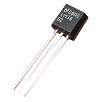

## Raspberry Piで
## 気温を知らせるTwitter Botをつくる

---
## 自己紹介

　植田達郎（@weed_7777）

- フリーランス
    - JavaScript
    - 物理教材ビデオ作成
- 趣味
    - 歴史、城巡り

---
## 温度センサ

- 120円

---
## 温度の測り方

- 摂氏（℃）に比例した電圧出力
    - 例
        - ０℃→０Ｖ
        - ２０℃→２００ｍＶ
- 要は、電圧を測れば、温度がわかる

---
## Arduinoで電圧を測る