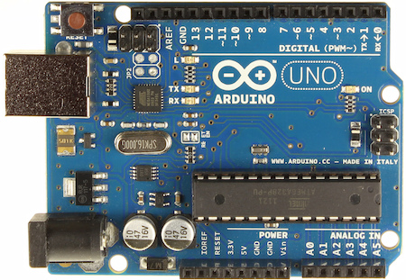
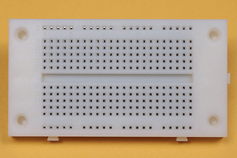
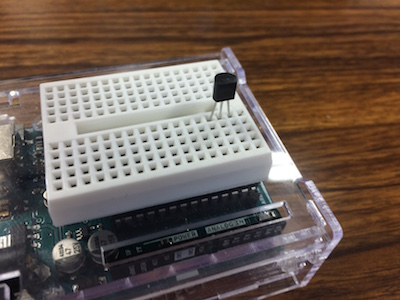
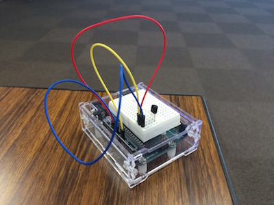
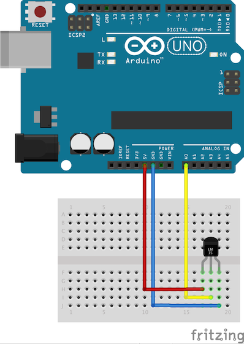

## Raspberry Piで
## 気温を知らせるTwitter Botをつくる

---
## 自己紹介

　植田達郎（@weed_7777）

- フリーランス
    - JavaScript
    - 物理教材ビデオ作成
- 趣味
    - 歴史、城巡り

---
## 実験

以下のようにツイートしてみて下さい：

```
@weed_hubot 室内温度は？
```

---
## 温度センサ


- 120円

---
## 温度の測り方


- 摂氏（℃）に比例した電圧出力
    - 例
        - ０℃→０Ｖ
        - ２０℃→２００ｍＶ
- 要は、電圧を測れば、温度がわかる

---
## Arduino



- 電圧を測る
- 3000円

---
## 電圧を測る


- Arduinoには電圧を測ることができるピンが6つある

---
## ブレッドボード

 

- 温度センサとArduinoをつなぐために使う
- 内部が右図のように導通している

---
## 温度センサを配置する



- こんな感じに刺します

---
## 配線する



- こんな感じにつないでいきます

---
## 配線図



---
## プログラム

```
void setup() {
}

void loop() {
  A_val = analogRead( A_inPin );
  delay(1000);
}
```

- `setup()`と`loop()`だけ書く
- 1秒ごとに電圧を測る（1024段階）

---
## 温度に直す

```
  tempC = ((5.0 * A_val) / 1024) * 100;
```

- 電圧を求めるには
  - 1024段階で 5 V
  - 入力値を1024で割って、5をかける
- 温度を求めるには
  - 1℃で 10 mV = 1/100 V
  - 電圧に100をかける

---
## シリアル通信


- ArduinoからRaspberry Piにデータを送る

---
## データを送る

```
void setup() {
  Serial.begin(9600); // シリアル通信の初期化
}

void loop() {
  ...

  Serial.println( tempC ); // シリアル通信に温度を書き込んでいる
  
  ...
}
```

---
## データを受け取る

- Raspberry PiはLinuxなので、 
- 受け取るプログラムはいろいろな言語で書ける
  - C
  - Python
  - Ruby
  - Java
  - Node（今回使用）

---
## Nodeプログラム（1）

```
serialport = require('serialport')

portName = '/dev/ttyACM0'
sp = new serialport.SerialPort portName, {
  baudRate: 9600
  dataBits: 8
  parity: 'none'
  stopBits: 1
  flowControl: false
  parser: serialport.parsers.readline("\n")
}

...
```

- シリアルポートを初期化する

---
## Nodeプログラム（2）

```
...

sp.on 'data', (input) ->
  console.log "部屋の温度は、#{input}℃です"
```

- シリアルポートからデータが送られてくるたびに、コンソールにメッセージを出す
- 表示された！（嬉しい）

---
## Twitter Bot


- **Hubot**を使う
  - GitHub社製Bot
  - Slack, IRCなどのチャットサービス用に、Slackアダプタ、IRCアダプタなどがある
  - CoffeeScript（JavaScript）でいろいろカスタマイズできる
  - 今回はTwitterアダプタ（後述）を改造して使う
- Raspberry PiにHubotをインストールする

---
## hubot-twitter-userstream


作者。素性不明。

- HubotのTwitterアダプタの一つ
- パブリックストリームを監視するように改造する
- ツイートが来たら温度を返すスクリプトを書く

---
## 