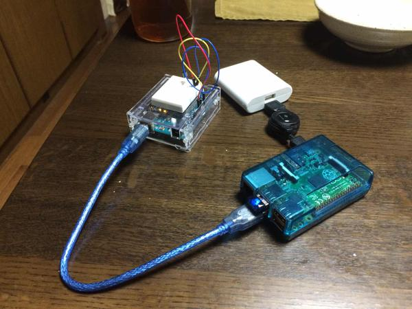
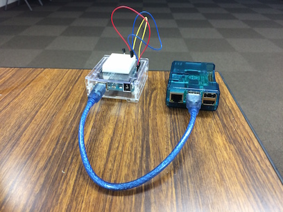
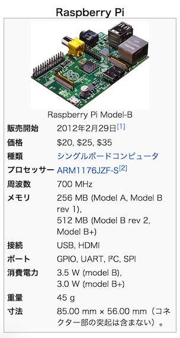
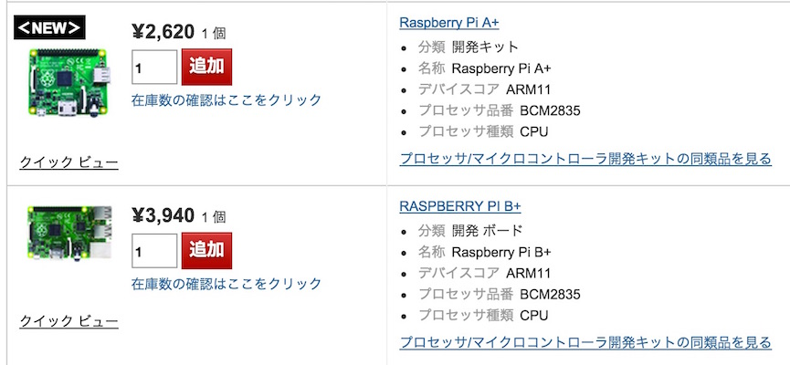

## Raspberry Piで
## 気温を知らせるTwitter Botをつくる

---
## 自己紹介

　植田達郎（@weed_7777）

- 元教員（10年間）
  - 中学理科、高校物理
- フリーランス（2年目）
  - 画像処理（勉強中）
  - 物理教材ビデオ作成（デモ）
  - JavaScript, ObjC
- 趣味
  - 城巡り

---
## 今回作ったもの



---
## 実験

以下のようにツイートしてみて下さい：

```
@weed_hubot 温度は？
```

---
## 温度センサ


- 120円

---
## 温度の測り方


- 摂氏（℃）に比例した電圧出力
    - 例
        - ０℃→０Ｖ
        - ２０℃→２００ｍＶ
- 要は、電圧を測れば、温度がわかる

---
## Arduino


- 電圧を測る
- 3000円

---
## 電圧を測る


- Arduinoには電圧を測ることができるピンが6つある

---
## ブレッドボード

 

- 温度センサとArduinoをつなぐために使う
- 内部が右図のように導通している

---
## 温度センサを配置する


- こんな感じに刺します

---
## 配線する


- こんな感じにつないでいきます

---
## 配線図


---
## プログラム

```
void setup() {
}

void loop() {
  A_val = analogRead( A_inPin );
  delay(1000);
}
```

- `setup()`と`loop()`だけ書く
- 1秒ごとに電圧を測る（1024段階）

---
## 温度に直す

```
  tempC = ((5.0 * A_val) / 1024) * 100;
```

- 電圧を求めるには
  - 1024段階で 5 V
  - 入力値を1024で割って、5をかける
- 温度を求めるには
  - 1℃で 10 mV = 1/100 V
  - 電圧に100をかける

---
## シリアル通信



- ArduinoからRaspberry Piにデータを送る

---
## データを送る

```
void setup() {
  Serial.begin(9600); // シリアル通信の初期化
}

void loop() {
  ...

  Serial.println( tempC ); // シリアル通信に温度を書き込んでいる

  ...
}
```

---
## データを受け取る：Raspberry Pi 



---
## 価格



---
## Raspberry PiはLinux

- ・・・なので、受け取るプログラムはいろいろな言語で書ける
  - C
  - Python
  - Ruby
  - Java
  - Node（今回使用）

---
## ここでボソッと

Node（JavaScript）、やってられん（懇親会で）

---
## Nodeプログラム（1）

```
serialport = require('serialport')

portName = '/dev/ttyACM0'
sp = new serialport.SerialPort portName, {
  baudRate: 9600
  dataBits: 8
  parity: 'none'
  stopBits: 1
  flowControl: false
  parser: serialport.parsers.readline("\n")
}

...
```

- シリアルポートを初期化する

---
## Nodeプログラム（2）

```
...

sp.on 'data', (input) ->
  console.log "部屋の温度は、#{input}℃です"
```

- シリアルポートからデータが送られてくるたびに、コンソールにメッセージを出す
- 表示された！（嬉しい）

---
## Hubot


- GitHub社製Bot
- Slack, IRCなどのチャットサービス用に、それぞれアダプタがある
- JavaScript / CoffeeScriptでいろいろカスタマイズできる
- 今回はTwitterアダプタ（後述）を改造して使う
- Raspberry PiにHubotをインストールする

---
## hubot-twitter-userstream

 作者。素性不明。

- HubotのTwitterアダプタの一つ
- パブリックストリームを監視するように改造する
- ツイートが来たら温度を返すスクリプトを書く

---
## パブリックストリーム

元のコード

```
stream = @client.stream('user')
```

改変したコード

```
stream = @client.stream('statuses/filter', {
    track: "@#{user.screen_name}"
})

```

- 要はメンションを監視するようにした
- これで、メンションを監視して特定のキーワードが入っていれば温度を返すことができた

---
## 実際の様子


---
## まとめ1

- 温度センサの値をTwitterで返すことができるようにした
  1. 温度センサ
  2. →Arduino（電圧）
  3. →Raspberry Pi（シリアル通信）
  4. →Twitter（Hubot）

---
## まとめ2

- Raspberry Piは使いやすい
  1. 今回のアプリケーションは2日でできた
  2. 見えるところ・見えないところで、いろいろケアされている感じ（Wifiの設定など）
- ほぼUbuntu / Linuxと同じ、つまり・・・
  1. 膨大なノウハウをそのまま使うことができる
  1. 膨大なドライバをそのまま使うことができる
- Python, Ruby, NodeなどのRasPi用ライブラリが充実している
- micro SDカードを入れ替えれば、別のハードウェア・アプリケーションにできる。新たに買わなくて良い。素晴らしい！

個人的な感触としては、Arduinoよりはるかに使いやすい（ただし、Arduinoはアナログ電圧を読み取ることができる）

---
## 追伸

## Raspberry Pi 2: 2/2より販売開始


- 処理速度6倍
- メモリ2倍（1GB）
- Raspberry Pi 1と完全互換
- $35

---
## Windows 10


- **Windows 10 @ Raspberry Pi 2** は、Makerに無料で配布
- MicrosoftがIoTに攻め込んだ
- C#, Visual Studio, .Net frameworkの世界

---
## まとめ3

- 何か一つハードウェア作品を作っておくと良い
- なぜなら、気軽にMake系イベントに申し込める！
- 本命は開発中でも企画中でも妄想中でも、心配せずに申し込める
- Make系イベントに「出展側」で参加すると大変やりがいがある

（おわり）