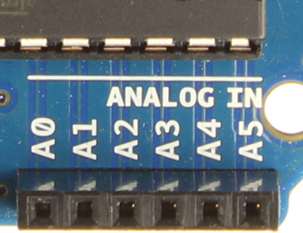

## Raspberry Piで
## 気温を知らせるTwitter Botをつくる

---
## 自己紹介

　植田達郎（@weed_7777）

- フリーランス
    - JavaScript
    - 物理教材ビデオ作成
- 趣味
    - 歴史、城巡り

---
## 温度センサ

- 120円

---
## 温度の測り方

- 摂氏（℃）に比例した電圧出力
    - 例
        - ０℃→０Ｖ
        - ２０℃→２００ｍＶ
- 要は、電圧を測れば、温度がわかる

---
## Arduino

- 電圧を測る
- 3000円

---
## 電圧を測る

- Arduinoには電圧を測ることができるピンが6つある

---
## ブレッドボード

 

- 温度センサとArduinoをつなぐために使う
- 内部が右図のように導通している

---
## 温度センサを配置する

- こんな感じに刺します

---
## 配線する

- こんな感じにつないでいきます

